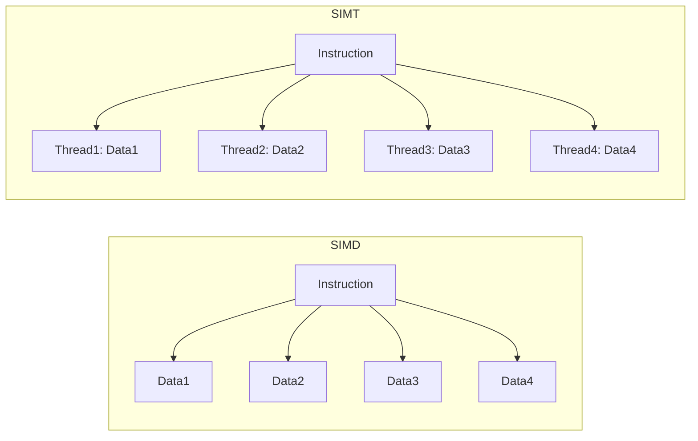

🍔 Real-world Analogy

**SIMD**:  
Like one chef using a 4-blade knife to cut 4 carrots at once.  
All cuts are identical and happen together.

**SIMT**:  
Like 4 chefs using regular knives. Each chef cuts 1 carrot.  
They follow the same recipe, but each one can go at a different pace or take different actions.

### Diagram Explanation:
- **SIMD (Single Instruction, Multiple Data)**:  
  A single instruction operates on multiple data elements simultaneously.  
  Represented by one instruction (`A1`) branching to multiple data points (`B1`, `B2`, `B3`, `B4`).

- **SIMT (Single Instruction, Multiple Threads)**:  
  A single instruction is executed by multiple threads, each working on its own data.  
  Represented by one instruction (`C1`) branching to multiple threads (`D1`, `D2`, `D3`, `D4`), each handling separate data.